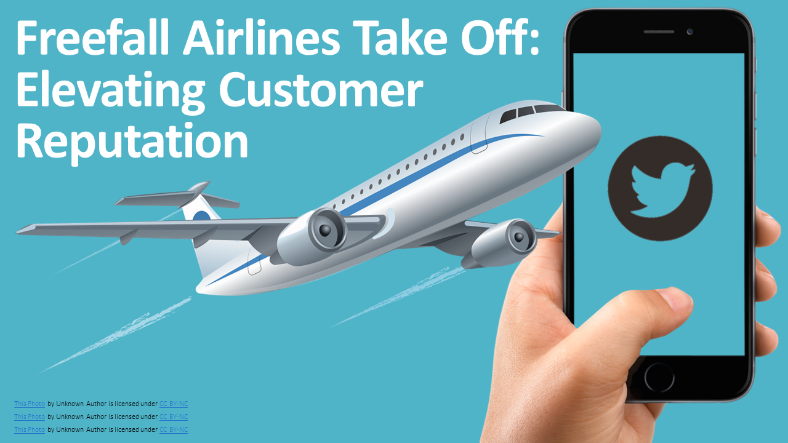
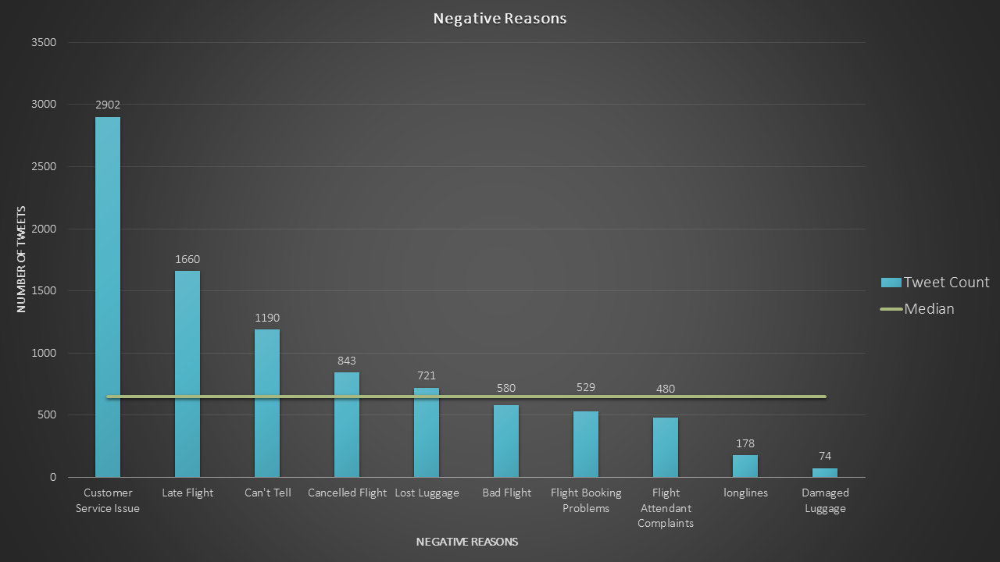
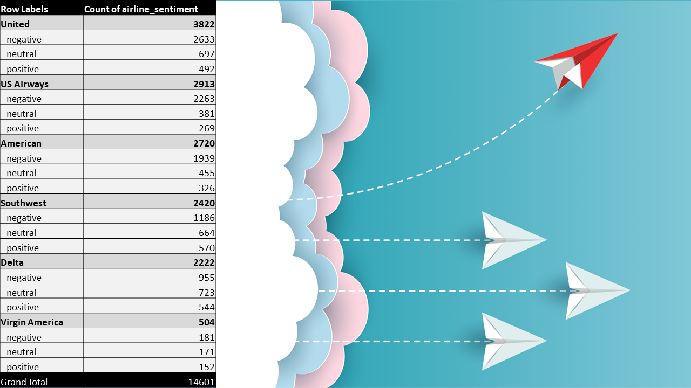
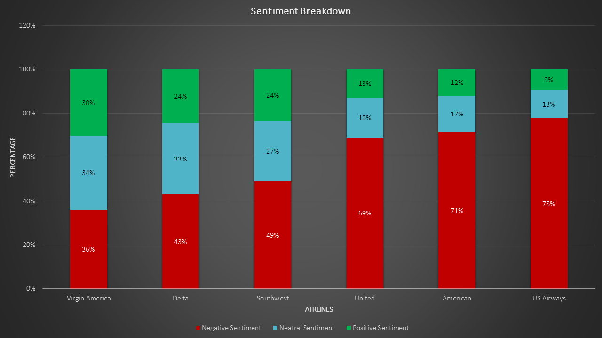
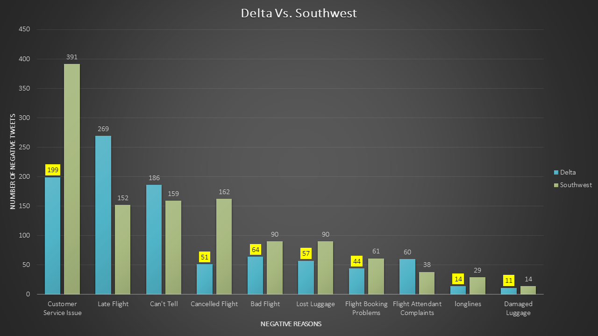
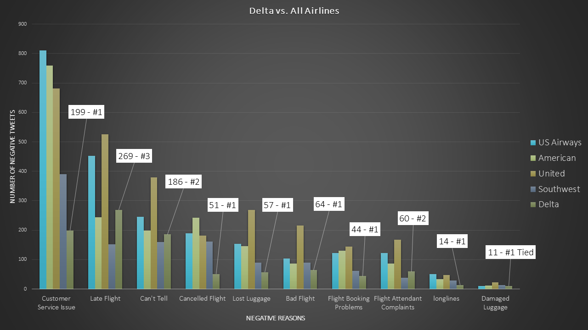
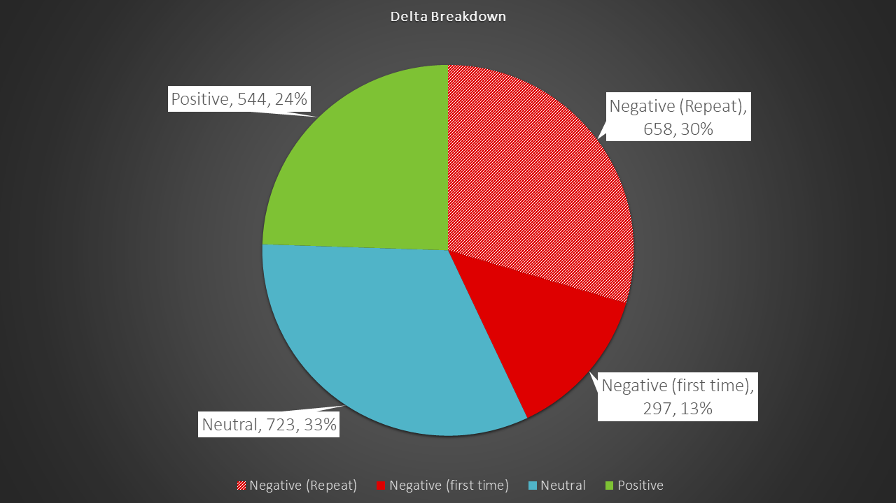
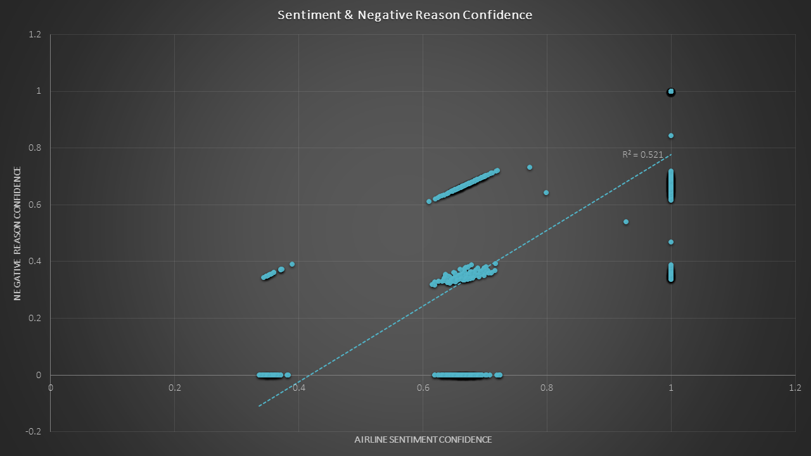
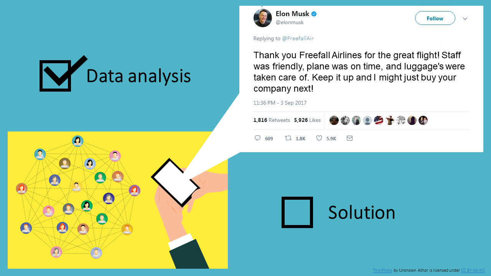

# Data Storytelling: Freefall Airlines

#### [Original CSV](https://github.com/MarkMinia/Project2/blob/main/Dataset/Tweets.csv)
#### [Cleaned CSV](https://github.com/MarkMinia/Project2/blob/main/Dataset/Tweets%20-%20Cleaned.csv)

##### Case Study: An airline company named Freefall Airlines does not have the best reputation, and they are trying to remedy that. They have tasked me with analyzing data from Twitter that captures people’s sentiments about various airline companies. The marketing team will use my results to come up with a brand-new advertising campaign modeled around the most positively rated airlines. My analysis would also be focusing on an airline to understand and show Freefall Airlines what to do/not to do and how to tackle these issues. 

##### Important notes: There is no Twitter data provided for Freefall Airlines, so we can not identify issues specific to Freefall. We are instead analyzing other airlines to create a general example for success that they can follow. 

##### Every passing second about 6,000 Tweets are posted. What are people talking about? Hopefully, how great Freefall Airlines is, right? We spend a lot of time on social media and Twitter is one of the largest platforms out there. Data is constantly collected from users for the world to see in the form of memes, food pics, and your favorite quote from your favorite book nobody has read. There are approximately 500 million Tweets per day and amidst all that nonsense there is significant value that can be extracted from that data. 

##### Customer Tweets from 2015 have been collected for analysis. These Tweets mention various airlines in the industry and are either positive, neutral, or negative in sentiment. Customer feedback can boost or damage an airlines’ reputation, so filtering through the negative remarks can provide insight into what actions should be taken. Freefall Airlines is deeply concerned about their declining reputation and wants to resolve it. This is where we step in. We’ve been tasked to analyze the top 6 airlines (in no particular order): Virgin America, US Airways, Delta, Southwest, American, and United. We want to understand what they are doing well and where they are failing. This information should also assist the marketing team as they begin planning on a brand-new marketing campaign to kick-start the rise of Freefall Airlines.

##### The goal for this analysis is to look at the various airlines and identify key areas of outperformance and underperformance using data from Twitter.
- ##### There was a total of 9157 total Tweets that were considered negative.
- ##### The solid line across represents the median total Tweets per category, which is approximately 651. 
- ##### The median was used over the average due to the clear outliers of 2902 and 74. This depicts a more appropriate idea of the data distribution.
- ##### Customer service issues ranked as the top concern amongst customer Tweets. 32 percent of all negative Tweets belonged to this category and represents the number one issue for airlines in general.
- ##### Late flights ranks second as it accounted for 18 percent of all negative Tweets.
- ##### “Can’t Tell” are Tweets that the system could not recognize as a valid reason. I decided to keep it in the data because the Negative Reason Confidence average for this group was 0.62, which means Twitter is fairly confident the Tweet recorded is negative. Removing this would skew the sentiment. 
- ##### Cancelled flight (9 percent) and lost luggage (8 percent) are both considerably less than the customer service count, but are still considered major issues being above the median and should be addressed.
- ##### Bad flight (6 percent), Flight booking problems (6 percent), and flight attendant complaints (5 percent) are just below the median, which is a sign that the airlines are taking proper measures to resolve and control these issues, but they should still be mindful of them.
- ##### Longlines (2 percent) and damaged luggage (1 percent) both come in at the bottom two. The airlines are doing a great job tackling those two issues and ensuring complaints are kept at a minimum. 

 

##### Now that we get the overall picture, let’s zoom in on the airlines themselves and observe where each stands. This histogram also helps puts things into perspective. Focusing on one of these airlines will provide additional information to help reinforce what steps Freefall should take.
- ##### Virgin America received the least amount of Tweets with 504, yet 30 percent of its total were positive; the highest amongst the group. It is excluded as an option for further study due to the low amount of Tweets
- ##### The ranks then move in order from Delta, then Southwest, United, American, and lastly US Airways.
- ##### United, American, and US Airways clearly received high negative sentiment and were eliminated as choices.
- ##### Both Delta and Southwest were comparable. Both are equally strong with 24 percent of Tweets being positive, yet Delta has less negative Tweets. It is true there is a slight edge to Southwest having stronger data with 198 more total Tweets. Let’s make an assumption that Delta’s next 198 Tweets were negative and that was added to its count, it would still have less negative Tweets than Southwest. As it stands when comparing negative reasons, Delta does better than Southwest in 7 out of 10 Negative Reason categories. This is why I chose Delta as the overall best airline to focus on. 

##### Here is a visualization of Delta against Southwest. The highlighted bars are categories that Delta received lower negative Tweets in. Why does this matter for Freefall? What benefit does Freefall get in understanding what Delta does? Delta has built a strong customer reputation, yes, but that’s not the only thing. Recall that the biggest issue affecting the top airlines was poor customer service. From this chart we can say that Delta has figured out how to control the biggest factor hurting an airlines’ reputation. If Freefall can apply similar ideas into their own process, there’s a good chance it will see a positive reaction from customers. 

##### To support the previous slide, here is how Delta ranks in each category against the other Airlines, excluding Virgin America. Their performance is strong across the board, which reinforces why Delta is a good example for Freefall Airlines to focus on. While there are other airlines with higher total Tweets contributing to their rankings, consider that the average total Tweets, excluding Virgin Airways, is 2819 with a standard deviation of 621; Delta is within 1 standard deviation. It is a fair comparison.

- ##### 658 of Delta’s 955 negative Tweets were from users that Tweeted multiple times from the same account. The assumption is that these users are repeat customers. In this case, that 658 makes up about 68.9 percent of all negative Tweets and about 30 percent of the grand total.
- ##### The probability that someone will fly with Delta and have a negative experience, given that they already had a negative experience, is 43 percent.
- ##### This insight is valuable because while Delta is performing well, a good chunk of their negative feedback is assumingly from repeat customers. This is an area that they seem to not be addressing. Freefall can avoid this issue and develop a strategy to improve the experience of their loyal customers and in return see an increase in positive feedback. 

- ##### R = 0.72
- ##### There is a strong positive correlation between the Airline Sentiment Confidence and Negative Reason Confidence. 
- ##### This implies that 72 percent of the variance in Negative Reason Confidence (how confident Twitter is that the Tweet is Negative) can be explained by the variability in the Airline Sentiment Confidence. 
- ##### If, for example, Airline Sentiment Confidence increases to 1, it’s very likely that the Negative Reason Confidence will be 1, too, which means the data is not entirely random. 
- ##### This information helps support the validity of the data. 

##### What do these insights mean for Freefall? Early on we indicated what the major issues are amongst all of the top airlines. Right away, we saw that having poor customer service is the top contributor to why an airline receives negative reviews. Other major areas that had a negative impact to their reputation were late flights, cancelled flights, lost luggage's, and because we do not have a specific reason for the “Can’t Tell” category we will substitute that with bad flights. These are considered the top 5 reasons a customer will post a negative Tweet about an airline.

##### Freefall’s marketing team should craft a brand-new campaign centered around VIP-level customer service, quality flight experiences, revised policies on late flights, cancelled flights, and lost luggage’s while also providing stricter luggage handling and security.

##### In order for Freefall to fulfill their mission and improve existing processes or create new ones, focusing on an airline that is succeeding in this space will help to understand what they should do. This is why Delta was chosen; Delta outperformed all other airlines. Freefall should be applying a similar system that replicates Delta’s results. Additionally, as great as Delta is, we can also target areas that Delta is lagging in an attempt to do better.
- ##### Establish clear guidelines for employees to follow when interacting with customers in-person, over the phone, and through other communication devices. 
- ##### Provide customer service training and re-training, as well as periodic coaching.
- ##### While late and cancelled flights can often be out of our control, it’s worth discussing with employees directly involved to identify possible causes. Ex. Air Traffic Controllers.
- ##### Create/revise reimbursement/rebooking policies in the event of cancelled flights.
- ##### Create/revise policies offering lodging, transportation, or food vouchers, as well as reimbursement in the event of late flights and lost luggage's.
- ##### Re-work logistics and reporting of checked-in luggage's.
- ##### Coordinate with flight crews to determine necessary equipment upgrades.
- ##### Increase in-flight selections for food, entertainment, and comfort. 
- ##### Create perks for repeat customers.
- ##### Create a loyalty program for repeat customers.

